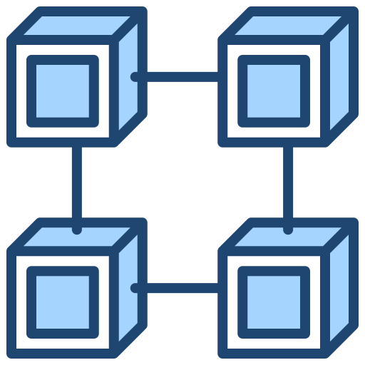

<br />

# Blockchain Node Availability Supervisor

This availability supervisor is a microservice that periodically monitors the availability of nodes registered in a configuration [file](/app/src/config.js). The configuration file should include nodes for at least two different blockchain networks (one non-EVM and one EVM-based). The project does not utilize the Web3 library for Ethereum or the bitcoin-core library for Bitcoin, as it is designed to demonstrate the use of JSON-RPC and the formatting of node data.

## Table of Content:

- [Tech Stack](#tech-stack)
- [Configuration](#configuration)
- [Periodic Availability Check](#periodic-availability-check)
- [Integrity check](#integrity-check)
- [Logging](#logging)
- [SLA](#sla)
- [Dockerized](#dockerized)
- [Environment Variables](#environment-variables)
- [Running the project](#running-the-project)

## Tech Stack

This project is built using:

- [Nginx](https://docs.nginx.com/)
- [Docker](https://docs.docker.com/)
- [NodeJS](https://nodejs.org/en/docs/)
- [Express](https://expressjs.com/en/5x/api.html)
- [Winston](https://github.com/winstonjs/winston/tree/2.x)

## Configuration

The configuration [file](./app/src/config.js) should include a list of nodes to be monitored, consisting of the node's name, URL, and type (EVM or non-EVM). The frequency of availability checks is configurable, with a default interval of 7 minutes and 30 seconds. Additionally, the maximum timeout for TCP handshake and HTTP connection is set to 60 seconds by default, but it can be configured to suit specific needs.

## Periodic Availability Check

The supervisor runs a [periodic availability check](./app/src/utils/check-availability.js) for each node registered in the configuration file. The [schedule](./app/src/utils/schedule.js) of the checks is designed to be randomized to prevent the targeted node from detecting a pattern and preparing with pre-computed answers.

Each check will include validation of the following:

- TCP handshake and HTTP connection, with a maximum timeout of 60 seconds
- Retrieval of the last block (e.g. using the eth_blockNumber JSON-RPC call on EVM-based chains), and validation that it is not too far behind the latest block number, using a pre-configured maximum blocks behind parameter.
- Verification that the node has finished synchronizing (e.g. using the eth_syncing JSON-RPC call, which should return false on EVM-based chains)
- A timeout value of 60 seconds for all checks above

## Integrity check

There is an optional [integrity check](./app/src/utils/integrity-check.js) that can be enabled or disabled using a configuration parameter. The integrity check is performed by maintaining a cache of JSON requests & responses from "trusted" nodes (configurable which node is trusted) and replicating those requests in one JSON RPC batch. Then it assesses if the data returned is the same.

## Logging

The supervisor persists the results of the availability checks in a log file. Utilizing a logging package such as [Winston](./app/src/winston.js), with support for multiple output streams, allows for flexibility in log management and storage. This ensures that the availability data is easily accessible and can be used for further analysis and reporting.

## SLA

For each day, the supervisor will compute the [SLA level](./app/src/utils/sla/index.js) for each node, using the SLA calculator from Omnia. This information is presented in a simple HTML format. The data is currently kept in memory but for a production-ready version, it is recommended to use a database for storage and scalability.

## Dockerized

Docker is a technology that allows for the creation and management of containerized applications. In order to use it on the project, Docker must be installed on the machine. Once Docker is installed, it can start its virtual machine and serve the containers with the necessary images.

Docker Compose is a tool that can be used to pull the images for this project and bundle all the components together. By running the command `docker-compose up --build`, it will build and start all the necessary containers.

This project requires two Dockerfiles, one for the [server](./app/Dockerfile) and another one for [NGINX](./nginx/Dockerfile) . It's important to note that these files should be located in the corresponding folders, for example the server Dockerfile should be in the server folder, and the nginx's one in the nginx folder. This allows easy management and maintenance of the different components of the project.

## Environment Variables

To properly run the project, certain environment variables must be configured. An example .env file has been provided with this project, containing new endpoints for testing purposes. The environment variables required for the project are:

```
NODE_ENV="development"
PORT=3010
CHECK_INTERVAL=450 # in seconds
MAX_TIMEOUT=60 # in seconds
MAX_BLOCKS_BEHIND=10
ETH_NODE_URL={node_url}
ETH_TRUSTED_NODE_URL={node_url}
BTC_NODE_URL={node_url}
BTC_TRUSTED_NODE_URL={node_url}
```

It is important to note that these variables must be set with the proper values in order for the project to function as intended. In a production environment, it is recommended to use a more secure method for storing sensitive information such as these URLs.

## Running the project

n order to run the project locally without using Docker, it is necessary to have Node.js and npm (Node Package Manager) installed on the local machine. Then we must navigate to the app directory of the project. Once these requirements are met, the dependencies of the project can be installed by executing the following command:

#### `npm install`

And then starting the service by running:

#### Production: `npm start`

#### Development: `npm run dev`

This will start the availability supervisor using the default configuration settings. An alternative option is to provide a custom configuration file to the supervisor by passing in the file path as a command line argument when starting the service:

#### `npm start -- --config-file=path/to/config.json`

The HTML report generated can be accessed via browser by hitting the endpoint: `http://localhost:3010`

## [Author](https://github.com/sstefdev)


Frontend - Test task


Context: Start from an existing implementation of basic blockchain node availability checker/supervisor. 

This availability supervisor runs a periodic availability check for each node registered in the configuration file. The configuration file should contain at least nodes for 2 chains (one non-EVM, i.e. Bitcoin, Solana, etc. and one EVM-based). 
When saying “node” we are generally referring to a JSON RPC endpoint behind a running synchronized node (i.e. Geth).

The granularity of the checks is configurable, with an initial value of 7min 30s (configuration should be as granular in no. of seconds). This means that the supervisor will do an availability check at least once in the configured interval.

Each check validates the following:
    • TCP handshake & HTTP connection with a maximum timeout of 60s (also configurable);­
    • 
    • Gets last block (i.e. eth_blockNumber JSON RPC call on EVM based chains) and validates that is not too much behind the lastest block number, using a pre-configured max blocks behind parameter.
    • Has finished synchronizing (i.e. eth_syncing JSON RPC call returns false on EVM based chains).
    • The timeout value of 60s applied to all checks above
eth
By default, the supervisor writes into a log file the results of the availability checks. 

For each check, the availability supervisor flips a coin (50% chance) that will run an integrity check as well. 
The integrity check will be performed by maintaining a cache of JSON requests & responses from “trusted” nodes (configurable which node is trusted) and replicating those requests in one JSON RPC batch then assess if the data returned is the same. 

For each day, the supervisor will compute in which SLA level each node belongs to (see https://omniatech.io/calculator.html for SLA levels) and show this info in a simple HTML format (we can keep data in-memory, for this test task it’s not mandatory to use a database).

Source code: https://drive.google.com/file/d/1UgPfKllTIPDBUH5wD4kMnEvBAAyLXLet/view?usp=sharing


TODO: Build a nice frontend in Angular that displays the above SLA results for the nodes and also how the checks (both availability and integrity) resulted over time, average timings, average block deviation, etc.  Use existing libraries such as Chart.js